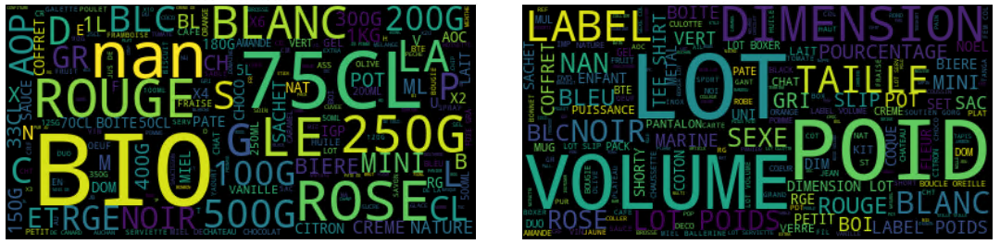
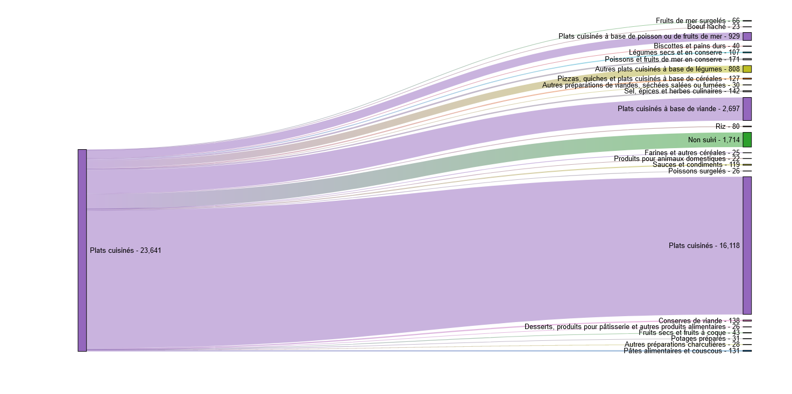

 

   
  <h3 align="center">Automated Classification Algorithms for Cash Register Data</h3>

   

  

 

[![Black][black-shield]][black-url] 
[![LinkedIn][linkedin-shield]][linkedin-url]
[![MIT License][license-shield]][license-url]

## Table of Contents

- [Table of Contents](#table-of-contents)
- [About the Project](#about-the-project)
  - [Built with](#built-with)
  - [Project Structure](#project-structure)
  - [Data used](#data-used)
- [Contributing](#contributing)
- [License](#license)
- [Contact](#contact)

## About the Project

INSEE (the National Institute of Statistics and Economic Studies) receives daily cash register data from French hypermarkets and supermarkets, which it uses to calculate the Consumer Price Index (CPI), used to estimate inflation, and the Sales Revenue Index (SRI). The nomenclature used for the CPI is Coicop (Classification of Individual Consumption According to Purpose), which groups consumed goods and services by function classes (for example, drinks are differentiated into mineral water, soda, etc.). To classify food products from the cash register data into this typology, INSEE uses a product reference list provided by a company specializing in supermarket data collection. However, this reference list does not cover the data of hard-discounters. The goal of the project is to explore supervised learning algorithms to assign hard-discounters products to a Coicop category to improve the construction of Consumer Price Index.

 

    

 

### Built with

* [Python](https://python.org)
* [spaCy](https://spacy.io/)
* [fastText](https://github.com/facebookresearch/fastText/tree/master/python)
* [hiclass](https://github.com/scikit-learn-contrib/hiclass)
* [quarto](https://quarto.org/)
* [Observable](https://observablehq.com/)

### Project Structure

- `requirements.txt` : Contains all the necessary dependencies to run this project
- `LICENSE.txt` : Contains the project's license terms
- `data-viz.qmd` : JavaScript code for plotting accuracy and Sankey diagrams
- `img/`: Contains images used in the README
- `src/`:  Folder containing the source code of the project
  - `features/`: Scripts dedicated to data preparation and transformation
      - `descriptive_statistics.py`: Generates descriptive statistics
      - `dic_cleaning_label.py`: Contains a dictionary of regular expressions for cleaning labels
      - `functions_clean_ean.py`: Functions for cleaning EAN (barcodes) codes
      - `function_clean_labels.py`: Functions for cleaning labels
      - `functions_get_true_label.py`: Functions for labeling data by matching
  - `models/`: Scripts to create, train, and evaluate models
      - `evaluation.py`: Evaluates the performance of the models
      - `flat_fasttext.py`: Implementation of the FastText model in a "flat" (non-hierarchical) architecture
      - `hiclass.py`: Implementation of the HiClass package for hierarchical classification
      - `lcpl_fasttext.py`: Variant of the FastText model in Local Classifier per Parent Level (experimental, not used in practice)
      - `lcpn_fasttext.py`: Variant of the FastText model in Local Classifier per Parent Node
  - `visualization/`: Scripts for data visualization and model results
      - `export_data_quarto.py`: Exports data and metrics in a format suitable for visualization
- `notebooks/`: Contains the Jupyter Notebooks for handling the developed functions
    - `clean_data.ipynb`: Notebook for data cleaning and preparation
    - `predict_label.ipynb`: Notebook for Coicop category prediction
    
 

    

 
    
### Data used

The code is designed to be fully reproducible; however, the actual transactional data used for the project cannot be shared due to its confidential nature. The code itself contains no sensitive or proprietary information related to this data.

## Contributing

All contributions are welcome. You can either [report a bug](https://gitlab.insee.fr/ssplab/codif-ipc/ddc_lidl/-/issues) or contribute directly using the following typical workflow :

1. Fork the Project
2. Create your Feature Branch (`git checkout -b feature/AmazingFeature`)
3. Commit your Changes (`git commit -m 'Add some AmazingFeature'`)
4. Push to the Branch (`git push origin feature/AmazingFeature`)
5. Open a Pull Request

## License

Distributed under the MIT License. See `LICENSE.txt` for more information.

## Contact

Lino Galiana - [linogaliana](https://github.com/linogaliana) - lino.galiana@insee.fr

Martin Monziols - martin.monziols@insee.fr

Julien Peignon - [JulienPeignon](https://github.com/JulienPeignon) - julien.peignon@ensae.fr

[black-shield]: https://img.shields.io/badge/code%20style-black-000000.svg
[black-url]: https://github.com/psf/black
[license-shield]: https://img.shields.io/github/license/othneildrew/Best-README-Template.svg?style=for-the-badge
[license-url]: https://github.com/JulienPeignon/supervised-learning-coicop/blob/master/LICENSE.txt
[linkedin-shield]: https://img.shields.io/badge/-LinkedIn-black.svg?style=for-the-badge&logo=linkedin&colorB=555
[linkedin-url]: https://linkedin.com/in/julien-peignon/